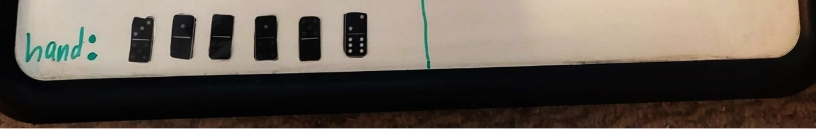

Buildup (C++) Collin Edition™ 

Real Life picture of Buildup Domino Game 

Note it’s one of the few domino games that uses 2 different colored set of dominoes 

Bug Report 

The only bug detected occurs when the domino location is listed in help mode. Sometimes this may be incorrect. 

Program execution 

This program was made using the 2019 Microsoft Visual Studio. The main executor is the main.cpp file. Please note that this game uses PCH: pre compiled headers via the respected headers.h and headers.cpp files, which is where the declared libraries are located e.g: #include <iostream>. In short, just add all of the files provided to you in this folder and press the “F5” key and watch as it compiles and executes. 

Feature List 

- Missing Features 

 Help mode sometimes it doesn’t choose non double tile when it has one double 

tile left 

- Extra features  

 Allow for user to enter and read serialization files with white space e.g OPL file 

number One

 If the file cannot be found, display .txt files found in the directory

Data Structures Used 

- A vector of strings was the primarily used data structure, and it was used for the following pieces… boneyard, hand, and stack. 
- A vector of Player pointers was used in implementing the polymorphic behavior in the game 

Classes 

- Round class  

This class is responsible for all information about a round including who won the 

round, who won the tournament, saving the game (SERIALIZATION of a 

tournament), who goes first, setting up the round, and setting up the tournament. Compositions: 

- player\_list: Vector of player pointers so that players can interact in the round polymorphically 
- Game class 

This class is responsible for running the entire game; everything from the 

welcome menu, playing a new game/tournament, and loading in a game from a serialization file. These are some of the key variables used within the class:

- player\_list: Vector of player pointers so that players can interact in the round polymorphically 
  - memory: Vector of strings used for reading in a SERIALIZATION file at each line and storing them.
- Domino class 

This class is responsible for handling all of the domino capabilities such as stacks, 

boneyards, and hands. In addition, it handles subsequent functions like determining if the domino can be placed at a location, or determining the value of the domino e.g w34 = white 7 pip domino. It uses 4 important variables that play a HUGE role in Buildup:

- bone\_yard: Vector of strings used for holding the tiles in the boneyard
- stack: Vector of strings used for holding the tiles in the stack
- hand: Vector of strings used for holding the tiles in the hand
- selected\_bone: String is used for holding the domino that was selected 
- Player class  

This class is the base class for each player. It handles all of the important player 

abilities like being able to call all of the important domino functions as well as  other functions like being able to tally score, make a move(polymorphic), and  determining the legal placement of a domino.

Compositions:

- Table: Domino object used for the player which is able to interact with said dominoes
- Human class  

This class is one of the two derived classes of the player class it provides its own 

input validation (user enters input) for selection and making a move (polymorphism). All of the functions are from the player class 

- Computer class  

This class is one of the two derived classes of the player class. It provides its own 

input validation (computer generates its own input) for selection and making a move (polymorphism). Most of the functions are from the player class, but computer also has ai\_decison function used for coming up with the domino selection (POLYMORPHIC) and will always return 2 (make a move since computer will ALWAYS play to win).

Log 

1. 1/16/2023: learned how to play Buildup, found a paper printable double 6 domino kit (located in the doc and made one of them black through editor), and attempted to play the game in real life with a family member. 
1. 1/17/2023: Created the project in 2019 Visual Studio and added in the appropriate classes and learned in greater detail how to play the game since it was the 1st day the professor went into detail of how to play buildup. 
1. 1/18/2023: Got the players’ boneyards to be created and shuffled along with defining all of the basic setup functions like setting up the boneyard and displaying it correctly.  
1. 1/19/2023: Got the first player to be declared by determining who drew the higher domino and also got the first hand to work correctly. 
5. 1/20/2023 – 1/21/2023: Took a break  
5. 1/22/2023: AS OF THIS DATE I got the make move declared and working for the human class along with the legal placement of domino is legal according to the game rules. 
5. 1/23/2023: Got make move to work for computer at random BUT LEGAL moves according to the game rules. 
5. 1/24/2023: Added some of the comment headers and added in some of the minor tweaks for better game optimization in terms of making the ascii graphics more efficient. 
5. 1/25/2022 -1/27/2023: worked on serialization and file parsing 
10. 1/28/2023-/1/31/3023: Worked on help mode and computer strategies. 
10. 2/1/2023-2/3/2023: Worked on extensive testing cleanup 
10. 2/4/2023-2/6/2023: Wrote user manual and added final touches including the ironing out of any glitches. 

Screen shots 

1. Main Menu

2. Round information so far

3. Computer player method

4. Help mode

5. Human input for stacking opponents stack 

6. Human input for stacking on its own stack

7. save game 

8. Load game 

9. When human player can’t make any moves 

10. Which player won 

11. Which player won the tournament 

